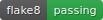

# 📘 LITRevu — Django Web Application



## 📄 Project Information

* **Author :** Sierra Ripoche
* **OpenClassrooms Project :** Développez une application Web en utilisant Django (Projet 9)
* **Framework :** Django 4.2.16
* **Python Version :** 3.11
* **Database :** SQLite
* **Image Storage (Production) :** Cloudinary API
* **Hosting :** Render.com (Dockerized deployment via GitHub)
* **Frontend Styling :** TailwindCSS
* **WSGI Server (Production) :** Gunicorn
* **Static File Handling :** Whitenoise + Cloudinary (media)
* **Continuous Integration :** GitHub Actions (linting + tests)
* **Deployed Site URL :** https://litrevu-735d.onrender.com

## 🧭 Overview
**LITRevu** is a full-stack Django web application designed as a social platform for literary exchange.
The goal of this project is to build a functional MVP that simulates a small community where users can:

-  **Créer des tickets** pour demander une critique d’un livre ou d’un article 
-  **Publier des critiques** en réponse à des tickets ou indépendamment 
-  **Suivre d’autres utilisateurs** pour constituer un flux personnalisé (page Flux)
-  **Consulter un fil d’actualité** regroupant les publications des utilisateurs suivis 
-  **Gérer leur activité** (leurs tickets, leurs critiques, leurs abonnements)

This MVP integrates authentication, content creation, user interactions, and a dynamic feed system, following Django best practices and modular app design.
It showcases clean URL routing, a clear separation of concerns between apps (`reviews` and `users), and a professional deployment pipeline emulating real-world production constraints.

## 🛠️ Technical Scope & Development Workflow
This project goes beyond a basic MVP and demonstrates a real engineering workflow:

### ✔️ Modular Architecture

- Two dedicated Django apps:
  - reviews (Tickets, Reviews, Feed logic)
  - users (Authentication, user following system, permissions)
- Clean separation between models, forms, views, templates, and static assets.

### ✔️ DRY & Component-Based Templating
To maintain consistency and avoid duplication across the application, the entire UI is built following Django’s template inheritance and componentization principles:

- A single `base.html` defines global layout, navigation, structure, and TailwindCSS imports.

- Reusable partials and components (e.g. headers, forms, ticket blocks, review cards) are placed into dedicated template includes.

- Templates extend from shared structures to keep views lean and focused on unique content.

- Shared UI patterns through Tailwind classes are reused throughout the project.

### ✔️ Modern Frontend Integration
- TailwindCSS for styling and utility-first component design
- Custom responsive layout adapted to the project’s template constraints

### ✔️ Cloud-Ready Production Setup
- Dockerized environment for consistent dev/prod parity

- Render.com hosting with persistent database volume

- Cloudinary API for media storage to avoid local filesystem loss on deploy

- Gunicorn + Whitenoise for performant static/media handling

### ✔️ CI/CD & Code Quality
- **GitHub Actions** pipeline triggered on every push or pull request to main, running two independent jobs:
  - **Linting job :**
    - Executes Flake8 with strict settings
    - Generates an HTML report + a badge displayed in the README
    - Fails the pipeline if linting errors are found
  - **Testing job :**
    - Runs Django’s built-in test runner (manage.py test)
    - Measures coverage using the coverage package
    - Generates XML and HTML coverage reports (uploaded as CI artifacts)
- While no strict coverage threshold is enforced automatically, the project maintains a **self-imposed target of ≥ 80% coverage**, in line with industry recommendations (e.g., IBM).
- Automated commits update the Flake8 badge whenever linting results change.
- `.flake8` + `isort rules ensure consistent code formatting across the whole codebase.

### ✔️ Agile Workflow & Version Tracking

- Full **Kanban board** (GitLab Projects) documenting:
  - User stories (with Gherkin templates)
- All feature branches kept visible to show incremental development 
- Frequent commits, atomic feature delivery, and structured merges

## Note to the Evaluator — Testing the *Flux* and *Abonnements* Features

When you log into the application with the credentials provided, your *Flux* (Feed) will initially appear empty. This is expected, as the feed only displays content from users you follow.

To allow you to fully test the **Abonnements** (Following) system and observe how the feed updates when following other users, I have created several test accounts.  
You may follow any of the usernames listed below; they can contain tickets and reviews used for demonstration purposes.

### 👥 Test Accounts
- AnaBanana  
- BubbasTheBunny  
- LovingBunny92  
- SiAerial90  
- SierraAdmin  
- SisiRipo  
- TestingAccount

Following one or more of these accounts will immediately populate your feed with their activity, allowing you to validate the functionality of:
- user following/unfollowing,
- feed updates and dynamic features tied into the feed (review buttons/messages in response to a ticket),
- ticket and review visibility from subscribed users.


## Project Structure
```bash
LITRevu/
├── LICENSE.md
├── LITRevu/                         # Django project package (settings + root config)
│   ├── __init__.py
│   ├── asgi.py                     # ASGI config
│   ├── settings.py                 # Django settings
│   ├── urls.py                     # URL router for the whole project
│   ├── utils/
│   │   └── toast.py                # Helper for toast redirect/messaging utilities
│   ├── views.py                    # Home view
│   └── wsgi.py                     # WSGI config
│
├── README.md
├── flake8_report/                  # Flake8 linting results + badge
│   ├── index.html
│   ├── badge.svg
│   └── styles.css
│
├── manage.py                       # Django management entry point
│
├── package.json                    # Node + Tailwind dependencies
├── package-lock.json
├── postcss.config.js               # PostCSS pipeline for Tailwind
├── tailwind.config.js              # Tailwind configuration
├── styles.css                      # Source file imported by Tailwind (input)
│
├── requirements.txt                # Python dependencies
│
├── reviews/                        # App: Tickets, Reviews, Feed
│   ├── __init__.py
│   ├── admin.py                    # Admin registrations
│   ├── apps.py
│   ├── forms.py                    # Django forms for Tickets & Reviews
│   ├── migrations/
│   ├── models.py                   # Ticket, Review, UserFollows models
│   ├── templatetags/
│   │   └── card_tags.py            # Custom template tags for displaying cards
│   ├── tests/
│   │   ├── test_forms.py
│   │   ├── test_models.py
│   │   └── test_views.py
│   ├── urls.py                     # All /flux/ URLs
│   └── views.py                    # Ticket creation, review creation, feed view
│
├── users/                          # App: Authentication and follows
│   ├── __init__.py
│   ├── admin.py                    # Custom User admin
│   ├── apps.py
│   ├── forms.py                    # RegistrationForm, LoginForm
│   ├── migrations/
│   ├── models.py                   # Custom User model
│   ├── tests/
│   │   ├── test_forms.py
│   │   └── test_views.py
│   ├── urls.py                     # /users/... URLs
│   └── views.py                    # register, login, logout, follows, posts
│
├── static/                         # Static files served by Django
│   ├── admin/                      # Django admin assets
│   ├── css/
│   │   └── tailwind.css            # Tailwind output (generated)
│   └── js/
│       ├── auth_forms.js
│       ├── header_menu.js
│       ├── ticket_form.js
│       └── toast.js
│
└── templates/                      # HTML templates
    ├── base.html                   # Root layout
    ├── home.html                   # Homepage
    ├── registration/
    │   └── register.html           # Signup page
    ├── reviews/
    │   ├── components/             # Reusable partials (ticket cards, stars, ...)
    │   ├── forms/                  # Form field partials
    │   └── pages/                  # Full pages (feed, create_ticket, create_review)
    └── users/
        └── pages/                  # User-related pages (posts, follows)

```

## Installation & Setup

#### 1. Clone the repository
1. Clone the repo
```bash
git clone https://github.com/SiRipo92/LITRevu
cd LITRevu
```
#### 2. Create and activate the virtual environment
To create:
```bash
python3 -m venv .venv
```

To activate:
- If using MacOS/Linux
```bash
source venv/bin/activate
```
- If using Windows
```bash
venv\Scripts\activate
```
#### 3. Install backend dependencies
```bash
pip install -r requirements.txt
```

### Backend setup
#### 4. Apply database migrations
```bash
python manage.py migrate
```

#### 5. Run the Django development server
```bash
python manage.py runserver
```

### Frontend (Tailwind CSS) Setup (Terminal 2)
#### 6. Install Node.js dependencies
*(Only needed the first time on a new machine)*

Since package.json is at the project root:
```bash
npm install
```

#### 7. Run Tailwind CSS in development mode
This watches your files and rebuilds static/css/tailwind.css:
```bash
npx tailwindcss -i ./styles.css -o ./static/css/tailwind.css --watch
```

The generated CSS goes here:
```
static/css/tailwind.css   ← compiled output (never edited manually)
```

## Production Notes
+ In production, you do NOT need Tailwind running in watch mode. 
+ You can run a one-time build before deploying:
    ```bash
    npx tailwindcss -i ./styles.css -o ./static/css/tailwind.css --minify
    ```
  After that:
  + Django will serve the compiled CSS from /static/css/ 
  + Node.js is not required on the production server.

## 🧑‍💻 Development Notes

+ **Linting (backend)**
  ```bash
  flake8 .
  ```
+ **Tailwind/CSS**
  + All custom styling is in `styles.css` 
  + Tailwind builds → `static/css/tailwind.css` 
  + Never modify `tailwind.css directly.


+ **HTML & CSS validated**
  + W3C HTML validator 
  + W3C CSS validator


+ **Lighthouse testing**
    + Pages audited for:
      + Accessibility 
      + Best practices 
      + SEO 
      + Performance
      

+ **Tests & Coverage**
  + Run the Django test suite (locally)
  ```bash
  python manage.py test users reviews
  ```
  + Run tests with coverage
  ```bash
  python -m coverage run --branch manage.py test users reviews
  python -m coverage report
  ```

_Last updated: 2025-11-28 (local run)_
```text
Name                                Stmts   Miss Branch BrPart  Cover   Missing
-------------------------------------------------------------------------------
reviews/admin.py                       10      0      0      0   100%
reviews/apps.py                         4      0      0      0   100%
reviews/forms.py                       36      5      8      1    77%   130-134
reviews/models.py                      45      3      0      0    93%   54, 110, 124
reviews/templatetags/card_tags.py      18      1      4      1    91%   61
reviews/urls.py                         4      0      0      0   100%
reviews/views.py                      154     22     16      5    82%   108-111, 124, 168->172, 210, 233-257, 283
users/admin.py                         10      0      0      0   100%
users/apps.py                           4      0      0      0   100%
users/forms.py                         21      0      0      0   100%
users/models.py                        14      1      0      0    93%   42
users/urls.py                           4      0      0      0   100%
users/views.py                         75      5     20      1    94%   130-133, 143
-------------------------------------------------------------------------------
TOTAL                                 399     37     48      8    88%

3 empty files skipped.
```

## License
This project is licensed under the 
[Creative Commons Attribution-NonCommercial-NoDerivatives 4.0 International License](https://creativecommons.org/licenses/by-nc-nd/4.0/).

© 2025 Sierra Ripoche — All rights reserved for educational use.